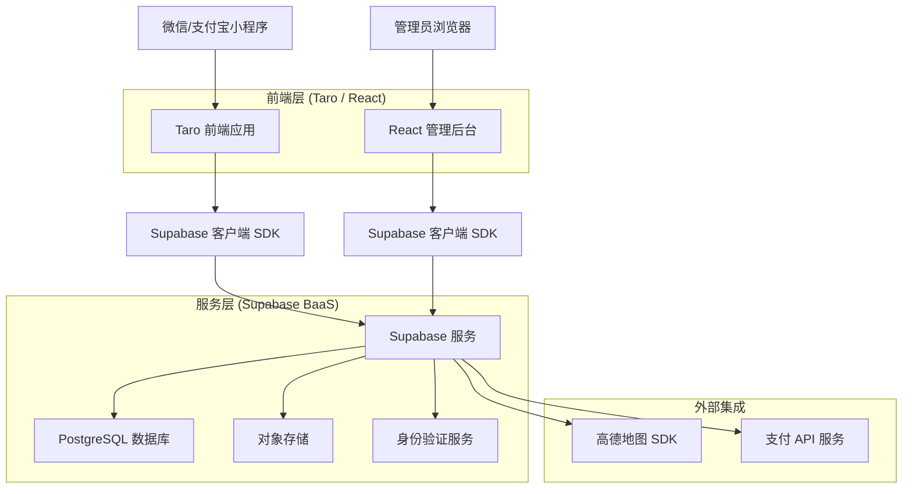
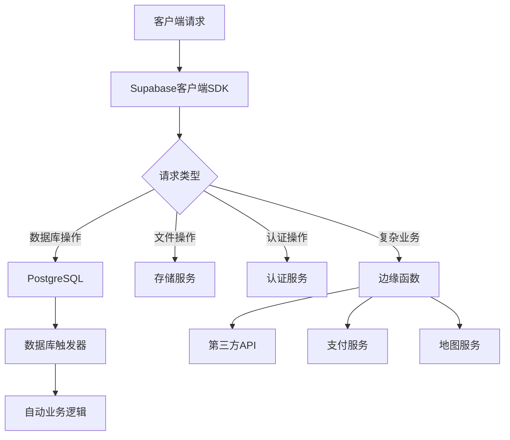
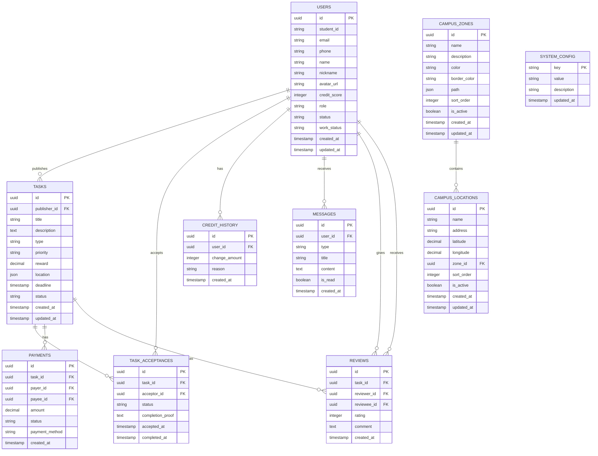

## 1. 架构设计



## 2. 技术描述

* **前端**:

  * 小程序端: Taro (React) + TypeScript + NutUI-React

  * 管理后台: React\@18 + TypeScript + Ant Design + Vite

* **后端**: Supabase (BaaS平台)

* **地图服务**: 高德地图微信小程序SDK / 高德地图JS API

* **支付服务**: 微信支付 / 支付宝小程序支付

* **UI组件库**: NutUI-React (小程序) + Ant Design (管理后台)

* **状态管理**: React Context + useReducer

* **小程序框架**: Taro\@3.6+ (支持多端编译)

## 3. 路由定义

### 用户端路由

| 路由                        | 用途               |
| ------------------------- | ---------------- |
| /pages/index/index        | 首页，任务地图和列表展示     |
| /pages/login/index        | 登录页面，支持微信登录      |
| /pages/auth/verify        | 校园认证页面           |
| /pages/task/publish/index | 任务发布页面，创建新任务     |
| /pages/task/detail/index  | 任务详情页面，查看任务信息和接单 |
| /pages/task/review/index  | 任务评价页面           |
| /pages/my-tasks/index     | 我的任务页面，管理发布和接单   |
| /pages/profile/index      | 个人中心，信息管理和信用分查看  |
| /pages/profile/edit       | 个人信息编辑页面         |

### 管理端路由

| 路由         | 用途              |
| ---------- | --------------- |
| /login     | 管理员登录页面         |
| /dashboard | 后台仪表盘，数据统计展示    |
| /tasks     | 任务审核页面          |
| /users     | 用户管理页面，信息和信用分管理 |
| /locations | 地点管理页面          |
| /zones     | 区域划分页面          |
| /settings  | 系统配置页面          |

## 4. API定义

### 4.1 任务相关API

**创建任务**

```
POST /api/tasks
```

请求参数：

| 参数名         | 类型       | 必填 | 描述           |
| ----------- | -------- | -- | ------------ |
| title       | string   | 是  | 任务标题         |
| description | string   | 是  | 任务描述         |
| type        | string   | 是  | 任务类型（代取/求助等） |
| reward      | number   | 是  | 酬金金额         |
| location    | object   | 是  | 任务位置信息       |
| deadline    | datetime | 是  | 截止时间         |

响应示例：

```json
{
  "id": "task_123",
  "status": "published",
  "created_at": "2026-03-12T10:00:00Z"
}
```

**接单任务**

```
POST /api/tasks/:id/accept
```

**完成任务**

```
POST /api/tasks/:id/complete
```

### 4.2 用户相关API

**用户注册**

```
POST /api/auth/register
```

**用户登录**

```
POST /api/auth/login
```

**更新信用分**

```
PUT /api/users/:id/credit
```

### 4.3 支付相关API

**创建支付订单**

```
POST /api/payments/create
```

**确认支付**

```
POST /api/payments/confirm
```

## 5. 服务端架构

由于使用Supabase BaaS平台，服务端逻辑主要通过以下方式实现：

1. **数据库触发器**: 处理数据变更时的自动逻辑
2. **边缘函数**: 处理复杂的业务逻辑和第三方API调用
3. **存储桶**: 管理文件上传和访问权限
4. **实时订阅**: 实现数据的实时推送



## 6. 数据模型

### 6.1 数据模型定义



### 6.2 数据定义语言

**用户表 (users)**

```sql
-- 创建用户表
CREATE TABLE IF NOT EXISTS public.users (
    id UUID PRIMARY KEY REFERENCES auth.users(id) ON DELETE CASCADE,
    student_id VARCHAR(20) UNIQUE,
    email VARCHAR(255) UNIQUE NOT NULL,
    phone VARCHAR(20) UNIQUE,
    name VARCHAR(100),
    nickname VARCHAR(100) DEFAULT '同学',
    avatar_url TEXT,
    credit_score INTEGER DEFAULT 100 CHECK (credit_score >= 0 AND credit_score <= 1000),
    role VARCHAR(20) DEFAULT 'student' CHECK (role IN ('student', 'admin')),
    status VARCHAR(20) DEFAULT 'unverified' CHECK (status IN ('active', 'suspended', 'banned', 'unverified')),
    work_status VARCHAR(20) DEFAULT 'off' CHECK (work_status IN ('off', 'active', 'standby')),
    created_at TIMESTAMP WITH TIME ZONE DEFAULT NOW(),
    updated_at TIMESTAMP WITH TIME ZONE DEFAULT NOW()
);
```

**任务表 (tasks)**

```sql
-- 创建任务表
CREATE TABLE IF NOT EXISTS public.tasks (
    id UUID PRIMARY KEY DEFAULT gen_random_uuid(),
    publisher_id UUID NOT NULL REFERENCES public.users(id),
    title VARCHAR(200) NOT NULL,
    description TEXT NOT NULL,
    type VARCHAR(50) NOT NULL CHECK (type IN ('delivery', 'help', 'tutoring', 'other')),
    priority VARCHAR(20) DEFAULT 'normal' CHECK (priority IN ('normal', 'urgent')),
    reward DECIMAL(10,2) NOT NULL CHECK (reward > 0),
    location JSONB NOT NULL,
    deadline TIMESTAMP WITH TIME ZONE NOT NULL,
    status VARCHAR(20) DEFAULT 'pending' CHECK (status IN ('pending', 'published', 'accepted', 'completed', 'cancelled')),
    created_at TIMESTAMP WITH TIME ZONE DEFAULT NOW(),
    updated_at TIMESTAMP WITH TIME ZONE DEFAULT NOW()
);

-- 创建索引
CREATE INDEX idx_tasks_publisher ON public.tasks(publisher_id);
CREATE INDEX idx_tasks_status ON public.tasks(status);
```

**任务接单表 (task\_acceptances)**

```sql
-- 创建任务接单表
CREATE TABLE IF NOT EXISTS public.task_acceptances (
    id UUID PRIMARY KEY DEFAULT gen_random_uuid(),
    task_id UUID NOT NULL REFERENCES public.tasks(id) ON DELETE CASCADE,
    acceptor_id UUID NOT NULL REFERENCES public.users(id),
    status VARCHAR(20) DEFAULT 'accepted' CHECK (status IN ('accepted', 'completed', 'cancelled')),
    completion_proof TEXT,
    accepted_at TIMESTAMP WITH TIME ZONE DEFAULT NOW(),
    completed_at TIMESTAMP WITH TIME ZONE,
    UNIQUE(task_id)
);

-- 创建索引
CREATE INDEX idx_acceptances_task ON public.task_acceptances(task_id);
CREATE INDEX idx_acceptances_acceptor ON public.task_acceptances(acceptor_id);
```

**信用分历史表 (credit\_history)**

```sql
-- 创建信用分历史表
CREATE TABLE IF NOT EXISTS public.credit_history (
    id UUID PRIMARY KEY DEFAULT gen_random_uuid(),
    user_id UUID NOT NULL REFERENCES public.users(id) ON DELETE CASCADE,
    change_amount INTEGER NOT NULL,
    reason VARCHAR(200) NOT NULL,
    created_at TIMESTAMP WITH TIME ZONE DEFAULT NOW()
);

-- 创建索引
CREATE INDEX idx_credit_history_user_id ON public.credit_history(user_id);
CREATE INDEX idx_credit_history_created_at ON public.credit_history(created_at DESC);
```

**支付表 (payments)**

```sql
-- 创建支付表
CREATE TABLE IF NOT EXISTS public.payments (
    id UUID PRIMARY KEY DEFAULT gen_random_uuid(),
    task_id UUID NOT NULL REFERENCES public.tasks(id),
    payer_id UUID NOT NULL REFERENCES public.users(id),
    payee_id UUID REFERENCES public.users(id),
    amount DECIMAL(10,2) NOT NULL CHECK (amount > 0),
    status VARCHAR(20) DEFAULT 'pending' CHECK (status IN ('pending', 'paid', 'refunded', 'completed')),
    payment_method VARCHAR(50),
    created_at TIMESTAMP WITH TIME ZONE DEFAULT NOW()
);
```

**消息表 (messages)**

```sql
-- 创建消息表
CREATE TABLE IF NOT EXISTS public.messages (
    id UUID PRIMARY KEY DEFAULT gen_random_uuid(),
    user_id UUID NOT NULL REFERENCES public.users(id) ON DELETE CASCADE,
    type VARCHAR(50) NOT NULL,
    title VARCHAR(200) NOT NULL,
    content TEXT NOT NULL,
    is_read BOOLEAN DEFAULT FALSE,
    created_at TIMESTAMP WITH TIME ZONE DEFAULT NOW()
);

-- 创建索引
CREATE INDEX idx_messages_user ON public.messages(user_id);
```

**评价表 (reviews)**

```sql
-- 创建评价表
CREATE TABLE IF NOT EXISTS public.reviews (
    id UUID PRIMARY KEY DEFAULT gen_random_uuid(),
    task_id UUID NOT NULL REFERENCES public.tasks(id) ON DELETE CASCADE,
    reviewer_id UUID NOT NULL REFERENCES public.users(id),
    reviewee_id UUID NOT NULL REFERENCES public.users(id),
    rating INTEGER NOT NULL CHECK (rating >= 1 AND rating <= 5),
    comment TEXT,
    created_at TIMESTAMP WITH TIME ZONE DEFAULT NOW()
);

-- 创建索引
CREATE INDEX idx_reviews_task ON public.reviews(task_id);
CREATE INDEX idx_reviews_reviewer ON public.reviews(reviewer_id);
CREATE INDEX idx_reviews_reviewee ON public.reviews(reviewee_id);
```

**系统配置表 (system\_config)**

```sql
-- 创建系统配置表
CREATE TABLE IF NOT EXISTS public.system_config (
    key VARCHAR(50) PRIMARY KEY,
    value TEXT NOT NULL,
    description VARCHAR(200),
    updated_at TIMESTAMP WITH TIME ZONE DEFAULT NOW()
);
```

**校园区域表 (campus\_zones)**

```sql
-- 创建校园区域表
CREATE TABLE IF NOT EXISTS public.campus_zones (
    id UUID DEFAULT gen_random_uuid() PRIMARY KEY,
    name TEXT NOT NULL,
    description TEXT,
    color TEXT DEFAULT '#3b82f6',
    border_color TEXT DEFAULT '#3b82f6',
    path JSONB DEFAULT '[]'::jsonb,
    sort_order INTEGER DEFAULT 0,
    is_active BOOLEAN DEFAULT true,
    created_at TIMESTAMPTZ DEFAULT NOW(),
    updated_at TIMESTAMPTZ DEFAULT NOW()
);

-- 创建索引
CREATE INDEX IF NOT EXISTS idx_campus_zones_active ON public.campus_zones(is_active);
```

**校园地点表 (campus\_locations)**

```sql
-- 创建校园地点表
CREATE TABLE IF NOT EXISTS public.campus_locations (
    id UUID DEFAULT gen_random_uuid() PRIMARY KEY,
    name TEXT NOT NULL,
    address TEXT,
    latitude DECIMAL(10, 6) NOT NULL,
    longitude DECIMAL(10, 6) NOT NULL,
    zone_id UUID REFERENCES public.campus_zones(id) ON DELETE SET NULL,
    sort_order INTEGER DEFAULT 0,
    is_active BOOLEAN DEFAULT true,
    created_at TIMESTAMPTZ DEFAULT NOW(),
    updated_at TIMESTAMPTZ DEFAULT NOW()
);

-- 创建索引
CREATE INDEX IF NOT EXISTS idx_campus_locations_zone ON public.campus_locations(zone_id);
CREATE INDEX IF NOT EXISTS idx_campus_locations_active ON public.campus_locations(is_active);
```

**自动创建用户触发器**

```sql
-- 创建函数，在用户注册时自动创建用户资料
CREATE OR REPLACE FUNCTION public.handle_new_user()
RETURNS TRIGGER AS $$
BEGIN
    INSERT INTO public.users (id, email, phone, nickname, name, student_id, credit_score, role, status, work_status)
    VALUES (
        NEW.id,
        COALESCE(NEW.email, COALESCE(NEW.raw_user_meta_data->>'phone', 'unknown') || '@campus.local'),
        COALESCE(NEW.raw_user_meta_data->>'phone', NEW.phone),
        COALESCE(NEW.raw_user_meta_data->>'nickname', '用户'),
        COALESCE(NEW.raw_user_meta_data->>'nickname', '用户'),
        NULL,
        100,
        'student',
        'unverified',
        'off'
    )
    ON CONFLICT (id) DO NOTHING;
    RETURN NEW;
END;
$$ LANGUAGE plpgsql SECURITY DEFINER;

-- 创建触发器
DROP TRIGGER IF EXISTS on_auth_user_created ON auth.users;
CREATE TRIGGER on_auth_user_created
    AFTER INSERT ON auth.users
    FOR EACH ROW EXECUTE FUNCTION public.handle_new_user();

-- 创建更新时间戳触发器函数
CREATE OR REPLACE FUNCTION update_updated_at_column()
RETURNS TRIGGER AS $$
BEGIN
    NEW.updated_at = NOW();
    RETURN NEW;
END;
$$ LANGUAGE plpgsql;
```

### 6.3 权限配置

```sql
-- 启用所有表的 RLS
ALTER TABLE public.users ENABLE ROW LEVEL SECURITY;
ALTER TABLE public.tasks ENABLE ROW LEVEL SECURITY;
ALTER TABLE public.task_acceptances ENABLE ROW LEVEL SECURITY;
ALTER TABLE public.credit_history ENABLE ROW LEVEL SECURITY;
ALTER TABLE public.payments ENABLE ROW LEVEL SECURITY;
ALTER TABLE public.messages ENABLE ROW LEVEL SECURITY;
ALTER TABLE public.reviews ENABLE ROW LEVEL SECURITY;
ALTER TABLE public.system_config ENABLE ROW LEVEL SECURITY;
ALTER TABLE public.campus_locations ENABLE ROW LEVEL SECURITY;
ALTER TABLE public.campus_zones ENABLE ROW LEVEL SECURITY;

-- 基础权限设置
GRANT ALL ON ALL TABLES IN SCHEMA public TO authenticated;
GRANT ALL ON ALL TABLES IN SCHEMA public TO anon;
GRANT ALL ON ALL SEQUENCES IN SCHEMA public TO authenticated;
GRANT ALL ON ALL SEQUENCES IN SCHEMA public TO anon;

-- 用户表 RLS 策略
CREATE POLICY "Allow all view" ON public.users FOR SELECT USING (true);
CREATE POLICY "Allow authenticated insert" ON public.users FOR INSERT WITH CHECK (true);
CREATE POLICY "Allow authenticated update" ON public.users FOR UPDATE USING (true);
CREATE POLICY "Admins can update all user profiles" ON public.users FOR UPDATE 
    USING ((SELECT role FROM public.users WHERE id = auth.uid()) = 'admin');

-- 任务表 RLS 策略
CREATE POLICY "Anyone can view published tasks" ON public.tasks FOR SELECT 
    USING (status IN ('published', 'accepted', 'completed'));
CREATE POLICY "Users can create tasks" ON public.tasks FOR INSERT 
    WITH CHECK (auth.uid() = publisher_id);
CREATE POLICY "Users can update their own tasks" ON public.tasks FOR UPDATE 
    USING (auth.uid() = publisher_id);

-- 任务接单表 RLS 策略
CREATE POLICY "Allow all insert" ON public.task_acceptances FOR INSERT WITH CHECK (true);
CREATE POLICY "Allow all select" ON public.task_acceptances FOR SELECT USING (true);

-- 信用分历史表 RLS 策略
CREATE POLICY "Users can view their own credit history" ON public.credit_history FOR SELECT 
    USING (auth.uid() = user_id);
CREATE POLICY "Admins can view all credit history" ON public.credit_history FOR SELECT 
    USING ((SELECT role FROM public.users WHERE id = auth.uid()) = 'admin');
CREATE POLICY "Admins can insert credit history" ON public.credit_history FOR INSERT 
    WITH CHECK ((SELECT role FROM public.users WHERE id = auth.uid()) = 'admin');

-- 支付表 RLS 策略
CREATE POLICY "Users can view their own payments" ON public.payments FOR SELECT 
    USING (auth.uid() = payer_id OR auth.uid() = payee_id);

-- 消息表 RLS 策略
CREATE POLICY "Users can view their own messages" ON public.messages FOR SELECT 
    USING (auth.uid() = user_id);
CREATE POLICY "Users can mark their own messages as read" ON public.messages FOR UPDATE 
    USING (auth.uid() = user_id);

-- 评价表 RLS 策略
CREATE POLICY "Anyone can view reviews" ON public.reviews FOR SELECT USING (true);
CREATE POLICY "Users can create reviews for tasks they participated in" ON public.reviews FOR INSERT 
    WITH CHECK (
        auth.uid() = reviewer_id AND
        EXISTS (
            SELECT 1 FROM public.tasks t
            LEFT JOIN public.task_acceptances ta ON t.id = ta.task_id
            WHERE t.id = task_id AND
            (
                (auth.uid() = t.publisher_id AND reviewee_id = ta.acceptor_id) OR
                (auth.uid() = ta.acceptor_id AND reviewee_id = t.publisher_id)
            )
        )
    );

-- 系统配置表 RLS 策略
CREATE POLICY "Everyone can read system config" ON public.system_config FOR SELECT USING (true);
CREATE POLICY "Admins can update system config" ON public.system_config FOR UPDATE 
    USING ((SELECT role FROM public.users WHERE id = auth.uid()) = 'admin');

-- 校园地点表 RLS 策略
CREATE POLICY "Allow public read access to campus_locations" ON public.campus_locations FOR SELECT USING (true);
CREATE POLICY "Allow admin full access to campus_locations" ON public.campus_locations FOR ALL 
    USING (
        (SELECT role FROM public.users WHERE id = auth.uid()) = 'admin' OR 
        (SELECT email FROM auth.users WHERE id = auth.uid()) LIKE '%admin%'
    )
    WITH CHECK (
        (SELECT role FROM public.users WHERE id = auth.uid()) = 'admin' OR 
        (SELECT email FROM auth.users WHERE id = auth.uid()) LIKE '%admin%'
    );

-- 校园区域表 RLS 策略
CREATE POLICY "Allow public read access to campus_zones" ON public.campus_zones FOR SELECT USING (true);
CREATE POLICY "Allow admin full access to campus_zones" ON public.campus_zones FOR ALL 
    USING (
        (SELECT role FROM public.users WHERE id = auth.uid()) = 'admin' OR 
        (SELECT email FROM auth.users WHERE id = auth.uid()) LIKE '%admin%'
    )
    WITH CHECK (
        (SELECT role FROM public.users WHERE id = auth.uid()) = 'admin' OR 
        (SELECT email FROM auth.users WHERE id = auth.uid()) LIKE '%admin%'
    );
```

